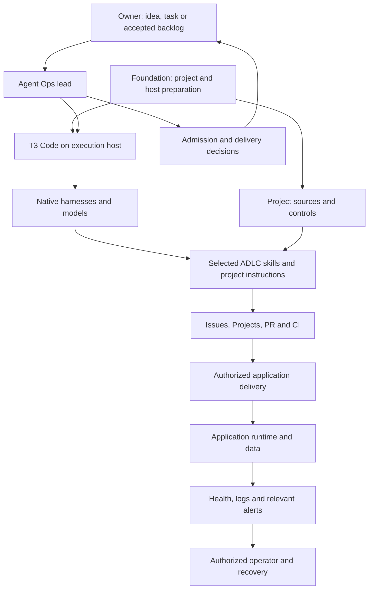

# Responsibility

The Mac/phone is an operator entry point. The Linux host runs T3, providers and
workspaces. Closing the client must not be assumed to preserve work until the
chosen service/connection has been tested. The host still needs power and network.
Application hosting is separate from the agent host. Its environments, data,
credentials, dependencies and recovery belong to the application. This remains
true if the two share a machine. A connected T3 service is not proof that the
application deploys, reports failures or can recover its data.

Foundation prepares the environment and observes readiness. Agent Ops researches,
prioritizes within authority, delegates, handles exceptions and reports outcomes.
ADLC skills perform the relevant task; they are not mandatory sequential jobs.
T3/native tools own sessions, status, interruption and recovery. GitHub owns
work status and delivery records. No Factory runtime sits between them.

## Context and control ownership

| Responsibility | Owner |
| --- | --- |
| Find existing project sources; establish missing context and initial checks | Foundation, within the setup/assessment mandate |
| Update affected context alongside product changes; independently check claims against the candidate | ADLC specification, implementation and review |
| Resolve concrete gaps when work, dependency changes or incidents reveal them | AgentOps, within the task's authority |
| Enforce access, checks and delivery rules; collect operational signals | Native harness/OS, GitHub and the application's selected infrastructure |
| Accept work and delivery or delegate those decisions | Project owner |

The [context reference](../foundation/factory-foundation/references/context.md)
covers dependencies, observability and honest verification notes. Keep a short
route to authoritative sources; a file named `dependencies.md` or
`observability.md` is optional. Neither docs nor skills enforce permissions or
prove security. Read back controls and exercise the relevant behavior.

For this method package, the existing sources are enough:

| Need | Source |
| --- | --- |
| Purpose and contributor instructions | [Vision](../VISION.md), [README](../README.md), [AGENTS](../AGENTS.md) |
| Build/test and release procedure | [Contributing](../CONTRIBUTING.md), [checks](../scripts/check.py), [tests](../tests), [CI configuration](../.github/workflows/check.yml) |
| Dependencies | Python standard library for optional helpers; the SHA-pinned action in CI; selected native tools/accounts and their version/access checks in [setup](../foundation/factory-foundation/references/setup.md) |
| Security and changing operational claims | [Security](../SECURITY.md), [qualification](qualification.md), [behavioral evidence](rehearsals.md); actual installations use a private [adoption record](../foundation/factory-foundation/references/adoption.md) |

The public package's native-tool references do not bundle their implementations
or credentials. Review an upstream version change and requalify the affected path.
CI configuration describes the workflow; current required checks and repository
protections must be read from GitHub. Package delivery uses reviewed tags and
staged files, not an application database or a Factory production service.

## Three different boundaries

- **Instructions:** selected skills, repository rules and accepted task context.
- **Native profile:** separate provider configuration, login, tools and history.
- **Host access:** actual OS user, filesystem, network and process permissions.

The first two do not enforce the third. T3 projects group work; they do not
sandbox the server account. A lead with cross-project oversight must not give
every worker all its context or credentials. Start with project-scoped work;
stronger trust separation uses distinct OS identities/environments or VMs.

The lead may read an idea without accepting it. Backlog status may describe
accepted work without starting an agent. A completed turn is not acceptance;
accepted code is not automatically merged, published or installed.

Use native worktree binding for concurrent writers. Delegating a chat can inherit
the parent's checkout, and changing directory inside a prompt does not necessarily
change the thread's bound workspace. Independent review uses the identified
candidate and a separate context. A second model alone does not prove independence.

Provider/model selection follows required capability, remaining judgment and
observed quota/cost. Start with a small supported set. The method does not hardcode
a best model, pool credentials or automatically buy overage. Usage comes from its
native source; missing data stays unknown.
