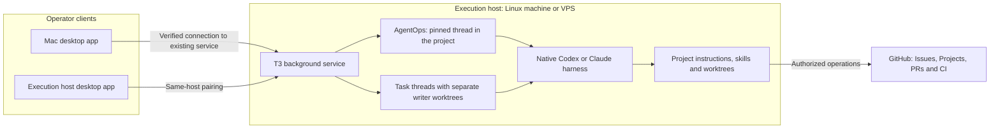

# AgentOps in your project

Keep one pinned **AgentOps** thread in the existing project. Preserve another name
if the owner has chosen one. The thread holds the lead role and current decisions;
the repository keeps the instructions and skill sources.

## Where work runs

Both apps can connect to the same service and show the same conversations. The
host runs the harness, commands and worktrees. Closing a client does not stop
an independent host service; the host still needs power and network. This does
not by itself establish automatic scheduling or recovery after interruption.

**Local environment** is an additional backend managed by the desktop app. For
clients used only with the execution host, follow the setup guide to turn it off
after preserving local work and verifying the saved remote connection. An app on
the execution host can also be a client of a separate OS account's service.

Verify the selected environment and project checkout with a harmless native turn.
On a POSIX host, have the agent run `uname -s`, `hostname`, `id -un` and `pwd`, then
compare them with the intended host/account/workspace. A separate SSH check proves
the host is reachable; it does not prove which environment the thread uses.

T3 0.0.45 gets the environment label from the server's friendly OS hostname. Its
device icon can describe laptop hardware even when that laptop runs Linux.
Neither identifies the operator's current client. In **Settings → Connections →
the environment's More actions → Icon**, choose **Linux/WSL** when that better
identifies a Linux host. This saves the native `environmentIcon: "linux"` server
setting, independent of hardware detection; it does not change where work runs.
A clearer friendly/pretty hostname is an optional host-administration change;
it is distinct from the network hostname. Preserve network names and access,
and leave the cosmetic change pending if the required privilege is unavailable.
In the thread's workspace selector, **Local checkout** means the project's main
checkout on the selected environment, as opposed to a separate worktree. It does
not move a remote project onto the client machine.

## Keep the role and skills together

1. Select the existing project on the intended environment. Inspect its checkout,
   instructions and threads; reuse an existing AgentOps thread when resuming.
2. Create the thread through native T3, choose the intended provider/model and
   verify its workspace. Coordination can use the main checkout; concurrent
   implementation writers still need separate worktrees.
3. Activate Agent Ops explicitly. Preserve the project's AGENTS/CLAUDE instructions.
   Supply the actual installed skill paths and relevant references, decision
   authority and parked work. Ask it to read the sources and report missing access
   before assigning a product task.
4. Pin the thread and set **Auto-settle behavior → Disabled** for that thread.
   Confirm the title, project, model and pin from the selected clients. Preserve
   completed trials as history; do not delete active work to tidy the sidebar.

Example startup message after resolving the actual paths:

> You are this project's AgentOps. Read the project instructions and vision,
> then the selected Factory Agent Ops skill and its policy and T3 references.
> Use Foundation for setup and the selected ADLC skills for accepted work. Handle
> ideas/research, explicit tasks and the approved backlog. Preserve the owner's
> admission and delivery decisions and any explicit scoped delegation. Report
> missing access without inventing results. This first turn only verifies the
> workspace, instructions and skill sources; start no implementation or delivery.

Skills follow native project/profile discovery; pinning changes the sidebar.
Other threads sharing the project do not automatically become AgentOps. Project
and thread boundaries are not OS or credential isolation. Use separate identities
or environments when the intended trust boundary requires them.

Inside the Factory source repo, load its canonical files explicitly. In an
adopting application, use reviewed native skill installation from the setup guide.
Direct file reading is not proof of native discovery. After a harness change,
replacement thread or lost context, reload the role and sources from the retained
setup record; a display name cannot restore them. Recheck the host/workspace after
reconnection before starting another task.

Perform authorized setup with the available native UI, CLI or supported settings
interface; do not hand routine steps back to the owner merely because the guide
uses UI labels. A locked desktop or missing privilege can hold that particular
step. Report it as pending, continue independent checks and never describe a
proposed command or record update as completed without execution and readback.

Verified: upstream workspace guidance; T3 0.0.45; 2026-10-07;
source inspection of the following references, not live client proof:
[thread pin and settlement](https://github.com/pingdotgg/t3code/blob/v0.0.45/docs/user/thread-sidebar.md),
[client connections](https://github.com/pingdotgg/t3code/blob/v0.0.45/docs/user/remote-access.md),
[environment labels](https://github.com/pingdotgg/t3code/blob/v0.0.45/apps/server/src/environment/ServerEnvironmentLabel.ts),
[detected hardware](https://github.com/pingdotgg/t3code/blob/v0.0.45/apps/server/src/environment/ServerEnvironmentMachine.ts),
[native icon selection](https://github.com/pingdotgg/t3code/blob/v0.0.45/apps/web/src/components/settings/EnvironmentIconPicker.tsx).
